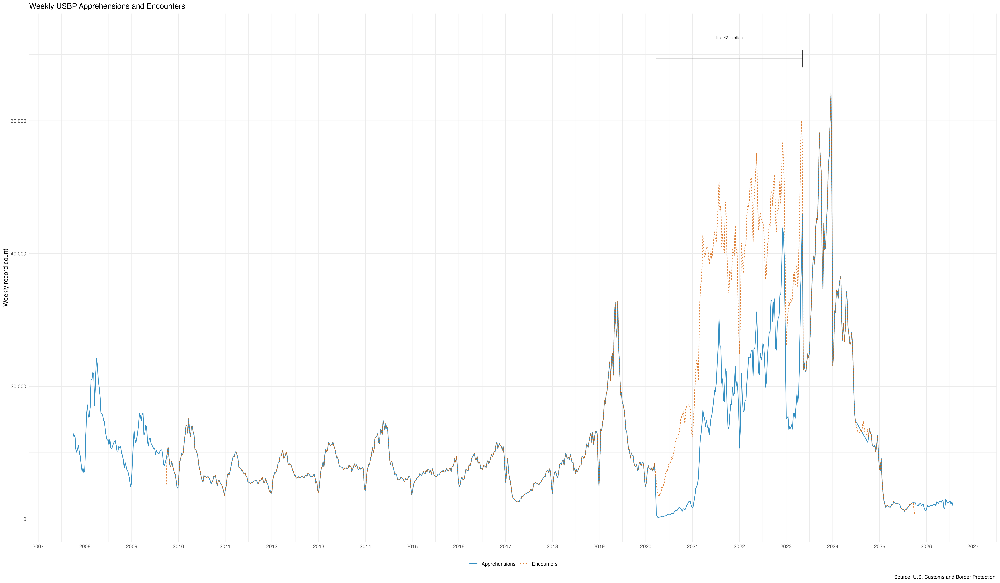

We have released two new CBP datasets: United States Border Patrol (USBP) encounters and USBP apprehensions. These datasets collect and standardize files obtained through FOIA requests. The encounters dataset covers USBP encounters from October 1, 2009 to October 1, 2025. The apprehensions dataset covers USBP apprehensions from October 1, 2007 to July 31, 2026 (CONFIRM THIS DATE AFTER RERUN). There is a small gap in the apprehensions data noted further below.

These datasets will be regularly updated as more data is released. We contribute clean, standardized CBP datasets that allow users to examine USBP encounters and apprehensions across previously fragmented files. We are currently working on finalizing the Office of Field Operations (OFO) inadmissibles dataset, the final dataset in this collection.

USBP apprehensions are apprehension events under Title 8 immigration authority. The USBP encounters dataset includes Title 8 apprehensions and Title 42 expulsions. It excludes OFO inadmissibility determinations, which will be released separately. It's important to note that these datasets count events, not unique individuals; a person may appear more than once. Title 42 was used from March 21, 2020 to May 11, 2023 by the Trump administration to expel people at U.S. borders during the COVID-19 pandemic and bypass typical opportunities for asylum. As is shown below, USBP encounters and USBP apprehensions are the same except during the time that Title 42 was enacted. 

In addition to these datasets, we have released filtering and visualization tools in hopes of making this data accessible to those without data analysis experience. We welcome any feedback on the usability of these tools.

Several notes about the datasets:

-   The Quarter 4, 2024 raw dataset in CBP's apprehensions files (`usbp_nationwide_apprehension_q4_fy_2024.xlsx`) was determined to be an erroneous duplicate of the prior dataset from Quarter 3, 2024 (`usbp_nationwide_apprehension_q3_fy_2024.xlsx`). A gap remains in the dataset after its removal.

-   We continue to review and standardize the fields in each dataset, so we recommend examining fields in detail before conducting analysis. 

-   Some fields have extremely high missingness, while others are largely redacted. Redaction codes are explained in more detail in our codebook. Note missingness and redaction levels when conducting analysis with this data. 

-   There was a gap in published data by CBP in 2014, which was obtained by Deportation Data Project co-director David Hausman, represented by the Law Office of Amber Qureshi and the National Immigration Project.

-   We continue to have questions about the reliability of files published by CBP and conduct cross examination between individual-level dataset and encounter count dashboards, which can be found [here](https://www.cbp.gov/newsroom/stats/nationwide-encounters). Weekly comparisons can be seen below.

***INSERT CROSS REF IMAGES 

We've posted the [apprehensions](https://01a0c641-4a64-eb9f-4422-6d8dddc6021a.share.connect.posit.cloud/?dataset=cbp-apprehensions) and [encounters](https://01a0cb57-24d3-dfa9-4e60-57771b7e1320.share.connect.posit.cloud
) datasets to the website, along with tools for[encounters](https://01a0cb57-24d3-dfa9-4e60-57771b7e1320.share.connect.posit.cloud/?dataset=cbp-encounters&tab=chart&s=eJxNyCEOgDAMQNG7fF2H62UaQpqBWEugYAh3n92T7-NFF-GutVC2fKIQ6uiO0jNqR2ieKGaR4WYI7Trn-AcTphZu) that allow users to filter the data and download subsets, an updated [codebook](https://deportationdata.org/preview/pr-428/docs/cbp.html), and a [README](INSERT LINK) to guide users through replicating and updating these datasets. 

